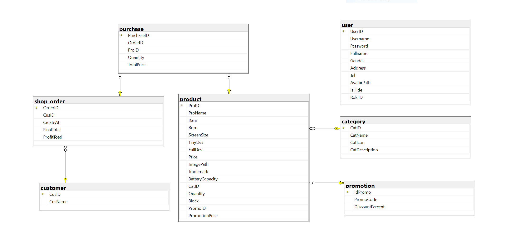

# Project MyShop about Mobile Phone

- Made with WPF C# .Net 7.0
- Student: Nguyễn Đức Hòa
- Student ID: 21424019

# Requirements

- Install [Visual Studio 2022](https://visualstudio.microsoft.com/downloads/)
- Install [SQL Server 2019](https://www.microsoft.com/en-us/sql-server/sql-server-downloads)

# Development

```
- Run `MyShopDB.sql` file in Assets/scriptDBs/. folder
- Install the app: myshop\Setup\Release\setup.exe
```

# Deployment

```
- Run MyShop.exe
```

# Database



# Overview

- Video Demo: 

- Dashboard Page
    
- Home Page
    
- Detail Page
    
- Order Page
    
- Create Order Page
    
- Report Page
    
- Category Page
    
- Extra Product Page
    
- Report Procuct Page
    

Thanks you
