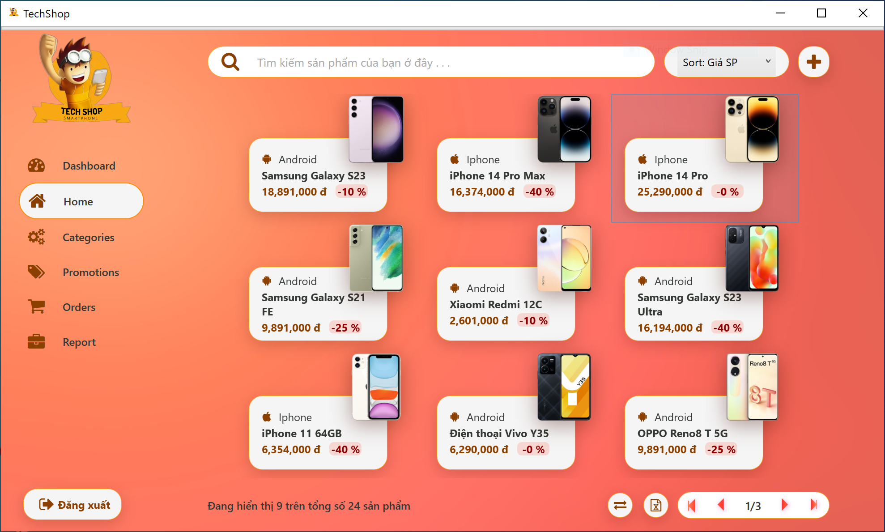
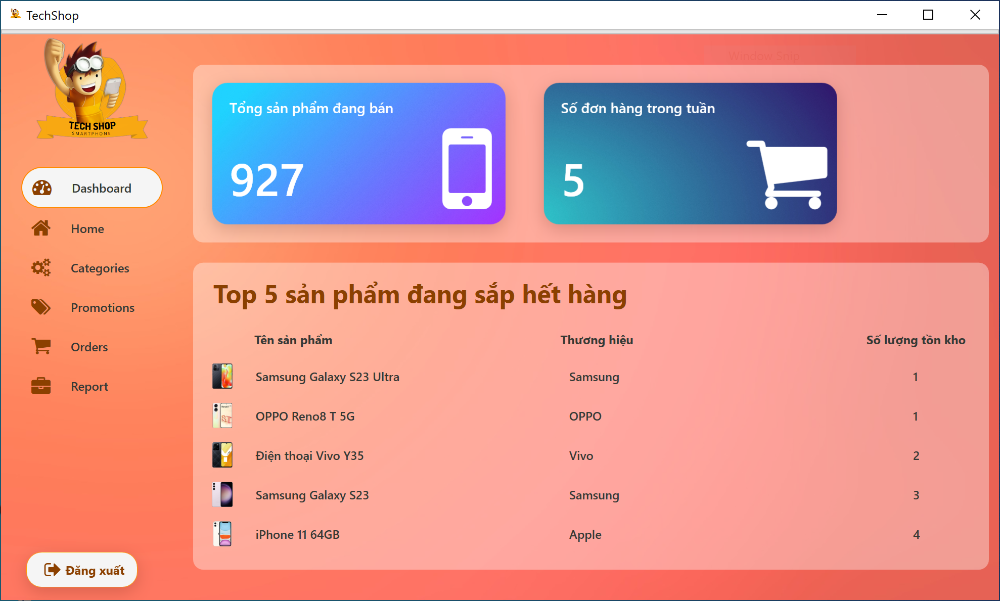
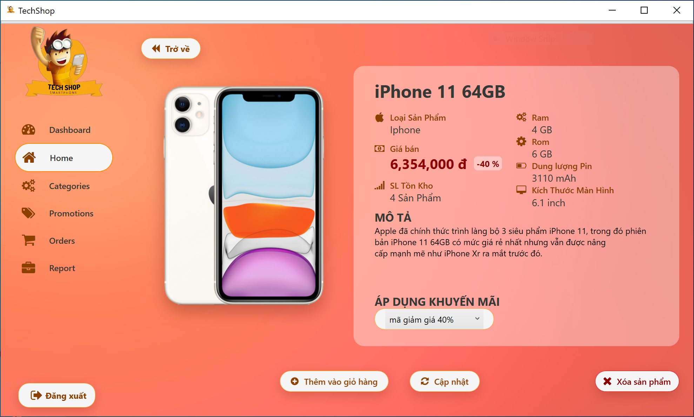
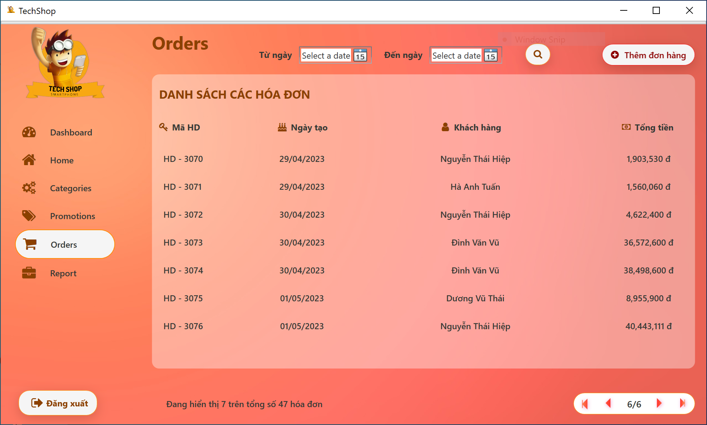
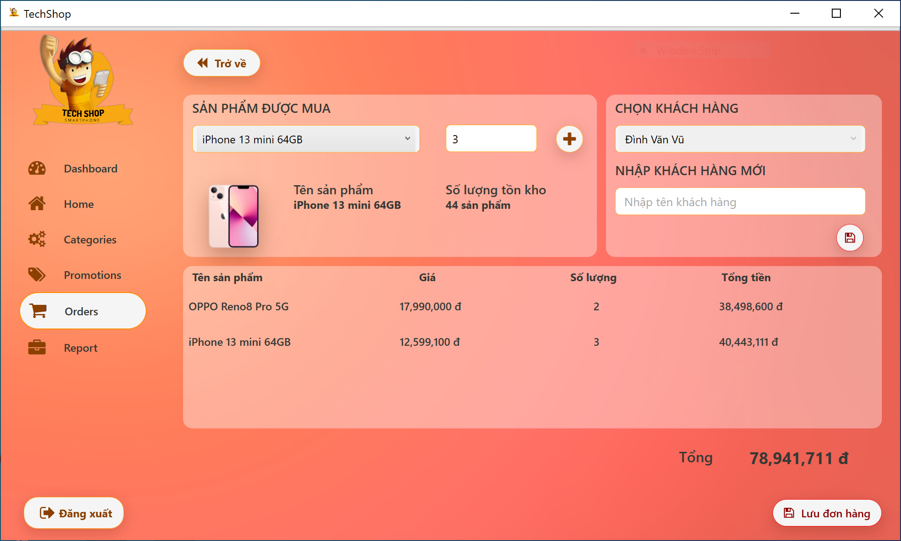
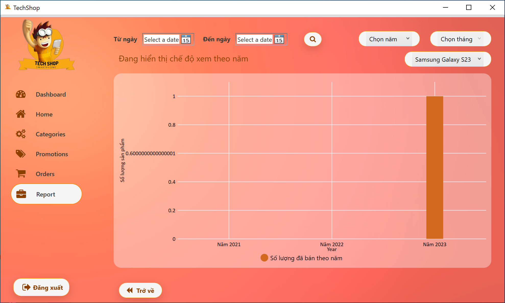
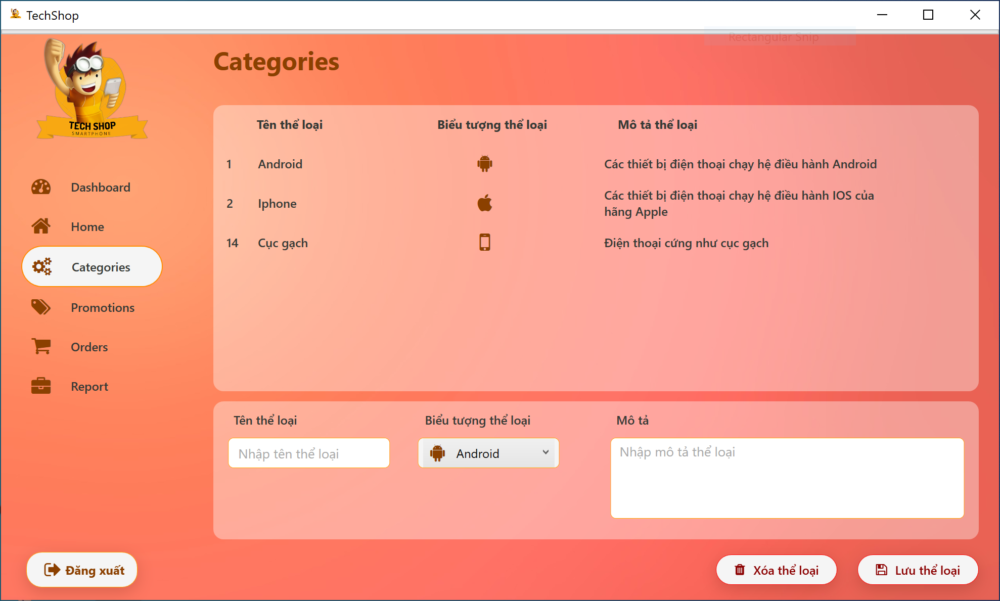
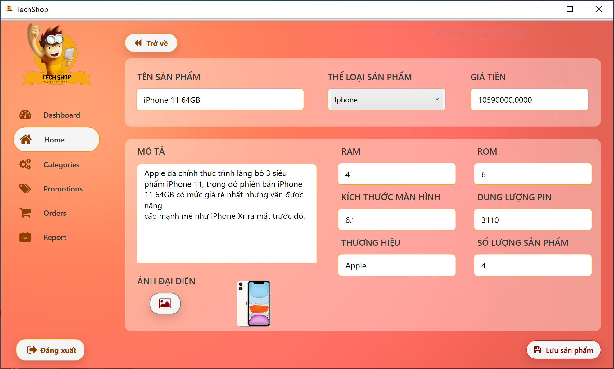
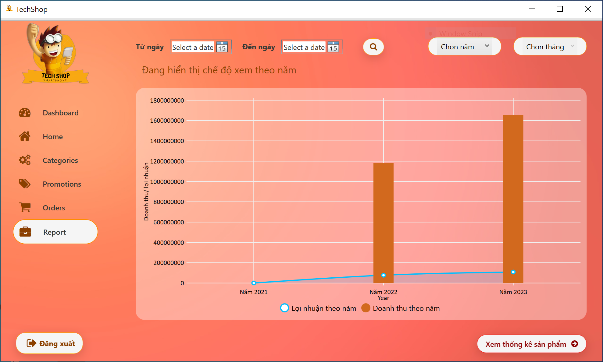

# Project Myshop

- Tech: WPF with .NET 7.0
- Database: SQL server
- Owner: Nguyen Duc Hoa 21424019

# Tools

- Install [Visual Studio](https://visualstudio.microsoft.com/downloads/)
- Install [SQL Server](https://www.microsoft.com/en-us/sql-server/sql-server-downloads)

# Development

```
- Run `myshopdb.sql` file in myshop\MyShop\Assets\ScriptDBs\myshopdb.sql
- Install the project throught `setup1.exe` file
```

# Deployment

```
- Run MyShop.exe
```

# Database


# Overview

1. Home Page
    
2. Overview with DashBoard
    
3. Detail Page
    
4. List Order Page
    
5. Add Cart
    
6. Report Page
    
7. Categories Page
    
8. Extra Product
    
9. Report Revenue
    
